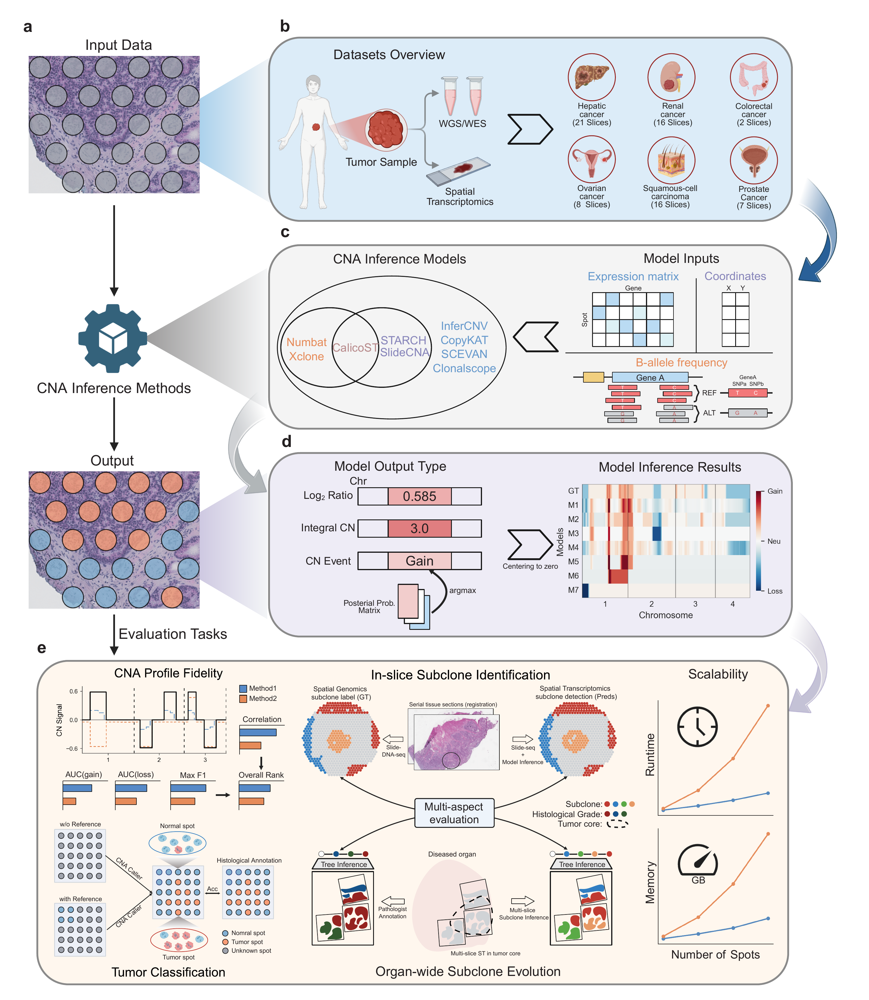

# ST-CNABench

ST-CNABench benchmarks CNA inference methods on spatial transcriptomics through one public controller for data preparation, model execution, and evaluation.

## Workflow

## Start Here

- New to the project: read [Overview](overview.md)
- Setting up the environment: read [Installation](installation.md)
- Want to run something immediately: go to [Quickstart Demo And Expected Outputs](tutorials/quickstart_demo.md)

## Core Parts

- [Dataset Preparation](data_preparation.md)
- [Model Run](model_run.md)
- [Evaluation](evaluation.md)
