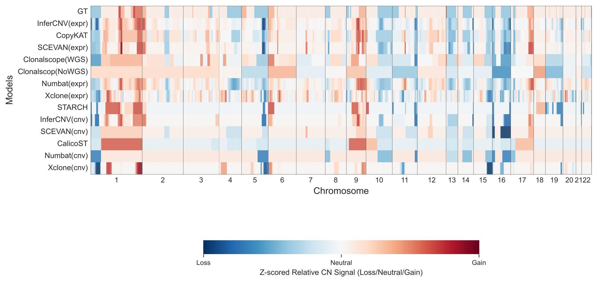
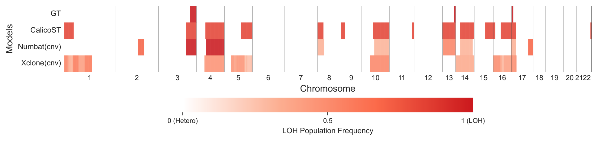
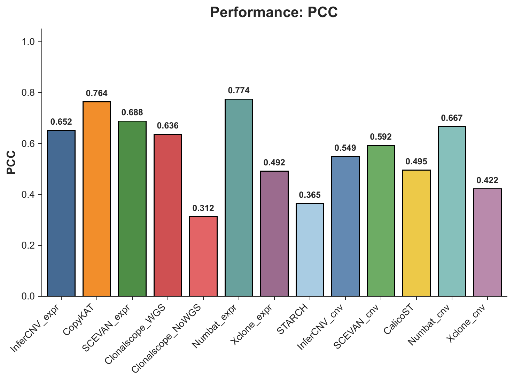
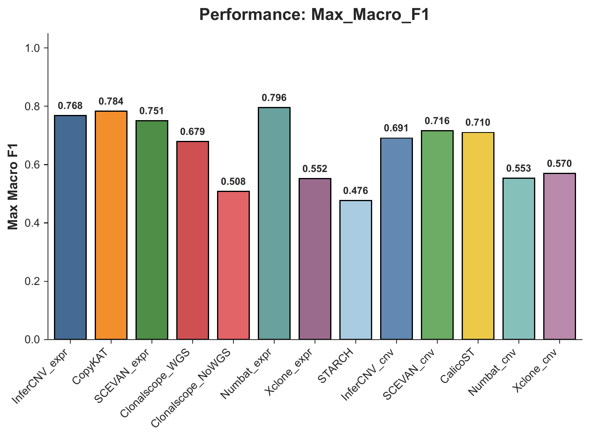

# CNA Profile Task Example

This tutorial shows how to run the `cna_profile` evaluation task.
It uses `HCC-2T` as the example dataset.

## Data Source And Assumptions

The HCC example is based on data from GSA-Human accession `HRA000437`.
In practice, raw FASTQ files are first processed with our standard upstream data workflow, and the resulting ST-CNABench-ready inputs are then used for `prep`, `run`, and `eval`.

In this tutorial, we assume:

- your `data.yaml` contains one dataset entry with `dataset_id: HCC-2T`
- the standardized input package is already available for that dataset
- your `models.yaml` already configures all CNA inference methods included in this benchmark
- your `eval.yaml` follows the same parameter structure as `configs/templates/eval.template.yaml`

For detailed config requirements, see [Dataset Preparation](../data_preparation.md), [Model Run](../model_run.md), and [Evaluation](../evaluation.md).

## Step 1: Prepare Data

Run:

```bash
st-cnabench --steps prep \
  --data-config data.yaml \
  --prep-ids HCC-2T
```

Check the prepared dataset under:

```text
<output.root>/
```

Expected standardized outputs include:

- `filtered_feature_bc_matrix/`
- `filtered_feature_bc_matrix.h5ad`
- `spatial/tissue_positions.csv`
- `spatial/scalefactors_json.json`

## Step 2: Run Models

Run all CNA inference methods configured for the benchmark:

```bash
st-cnabench --steps run \
  --data-config data.yaml \
  --model-config models.yaml \
  --prep-ids HCC-2T \
  --exec-mode conda
```

Check raw model outputs under:

```text
<results_dir>/HCC-2T/<model_name>/
```

## Step 3: Evaluate CNA Profile

Run `cna_profile` evaluation across all configured methods:

```bash
st-cnabench --steps eval \
  --data-config data.yaml \
  --eval-config eval.yaml \
  --prep-ids HCC-2T \
  --eval-tasks cna_profile
```

Check evaluation outputs under:

```text
<eval_dir>/HCC-2T/cna_profile/
```

Typical outputs include:

- CNA profile metrics summary tables
- per-method CNA profile comparison plots
- karyogram-level comparison plots

## Example Results

### Copy Number Karyogram

This figure shows the copy-number profile karyogram across all methods.



### LOH Karyogram

This figure shows the LOH-status karyogram across all methods.



### PCC Summary

This figure summarizes CNA-profile concordance using the Pearson correlation coefficient.



### Max Macro F1 Summary

This figure summarizes discrete CNA-event agreement using the maximum macro F1 score.



## Try Next

- For the packaged cSCC demo, go to [Quickstart Demo And Expected Outputs](quickstart_demo.md)
- For the tumor-normal task example, go to [Tumor-Normal Classification Task Example](tumor_normal_hcc2t.md)
- For the subclone task example, go to [Subclone Identification Task Example](subclone_identification_slidednaseq.md)
- To adapt the workflow to your own data, go to [Use Your Own Dataset](use_your_own_dataset.md)
