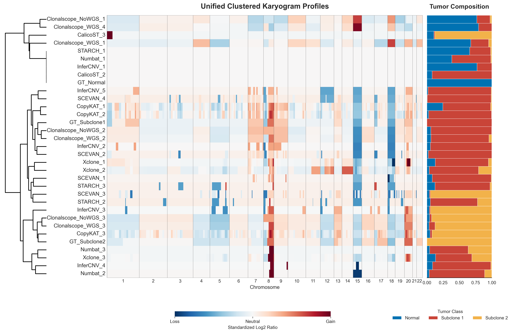

# Subclone Identification Task Example

This tutorial shows how to run subclone identification on a paired Slide-DNA-seq and Slide-seq v2 dataset.
It uses `SlideRNAseq_human_colon` as the example dataset.

## Data Source And Assumptions

The paired Slide-DNA-seq and Slide-seq v2 dataset is publicly available from the Sequence Read Archive under accession `PRJNA768453`.
Raw FASTQ files are processed through our upstream workflow, with the processing details described in the manuscript Methods section, and the resulting benchmark-ready package is then used as the input to ST-CNABench.

In this tutorial, we assume:

- your `data.yaml` contains one dataset entry with `dataset_id: SlideRNAseq_human_colon`
- the standardized input package is already available for that dataset
- `raw.subclone_gt` is set to the paired Slide-DNA-seq subclone annotation used as the ground truth
- `raw.cna_gt` is set to the clone-level CNA ground truth used for clonal CNA profile comparison
- `raw.beads_mapping` is available when Slide-DNA-seq style pseudo-barcodes must be mapped back to original bead barcodes
- your `models.yaml` already configures all benchmark methods that support subclone identification in this benchmark
- your `eval.yaml` follows the same parameter structure as `configs/templates/eval.template.yaml`

For detailed config requirements, see [Dataset Preparation](../data_preparation.md), [Model Run](../model_run.md), and [Evaluation](../evaluation.md).

## Step 1: Prepare Data

Run:

```bash
st-cnabench --steps prep \
  --data-config data.yaml \
  --prep-ids SlideRNAseq_human_colon
```

Check the prepared dataset under:

```text
<output.root>/
```

Expected standardized outputs include:

- `filtered_feature_bc_matrix/`
- `filtered_feature_bc_matrix.h5ad`
- `spatial/tissue_positions.csv`
- `spatial/scalefactors_json.json`

## Step 2: Run Models

Run all benchmark methods that support subclone identification:

```bash
st-cnabench --steps run \
  --data-config data.yaml \
  --model-config models.yaml \
  --prep-ids SlideRNAseq_human_colon \
  --exec-mode conda
```

Check raw model outputs under:

```text
<results_dir>/SlideRNAseq_human_colon/<model_name>/
```

## Step 3: Evaluate Subclone Identification

Run in-slice subclone evaluation across all configured methods that support this task:

```bash
st-cnabench --steps eval \
  --data-config data.yaml \
  --eval-config eval.yaml \
  --prep-ids SlideRNAseq_human_colon \
  --eval-tasks subclone_detection_in_slice
```

Check evaluation outputs under:

```text
<eval_dir>/SlideRNAseq_human_colon/subclone_detection/
```

Typical outputs include:

- subclone prediction tables
- clone-level CNA profile comparison outputs
- spatial subclone visualization plots
- summary metrics tables

## Example Results

### Clonal CNA Profile Karyogram

This figure shows the clustered clonal CNA profile karyogram across all methods.
For readability, the legend colors were adjusted in the final figure, while the default plotting palette is based on `tab20`.



### Spatial Subclone Visualization

This figure shows the spatial subclone predictions across methods.
For readability, the legend colors were adjusted in the final figure, while the default plotting palette is based on `tab20`.


## Try Next

- For the packaged cSCC demo, go to [Quickstart Demo And Expected Outputs](quickstart_demo.md)
- For the CNA profile task example, go to [CNA Profile Task Example](cna_profile_hcc2t.md)
- For the tumor-normal task example, go to [Tumor-Normal Classification Task Example](tumor_normal_hcc2t.md)
- To adapt the workflow to your own data, go to [Use Your Own Dataset](use_your_own_dataset.md)
