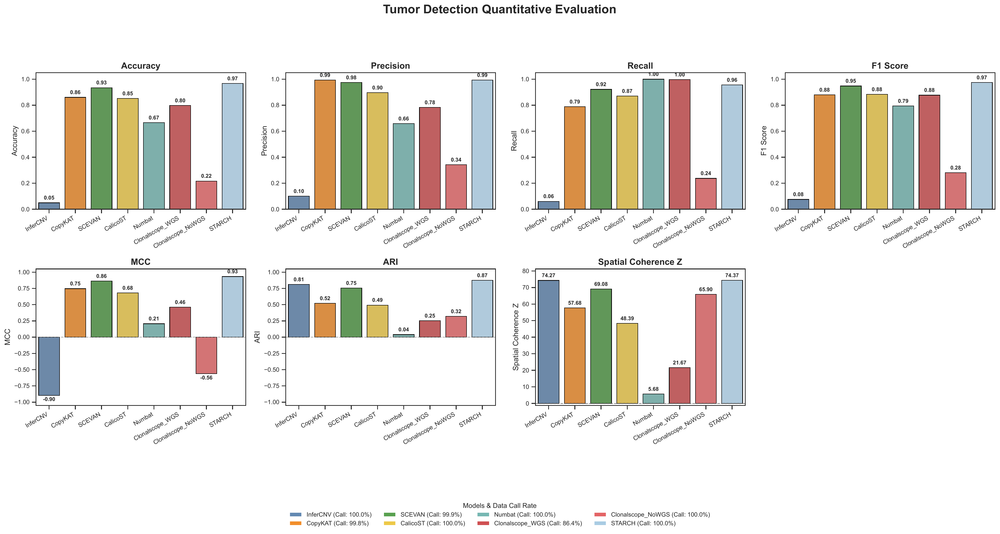
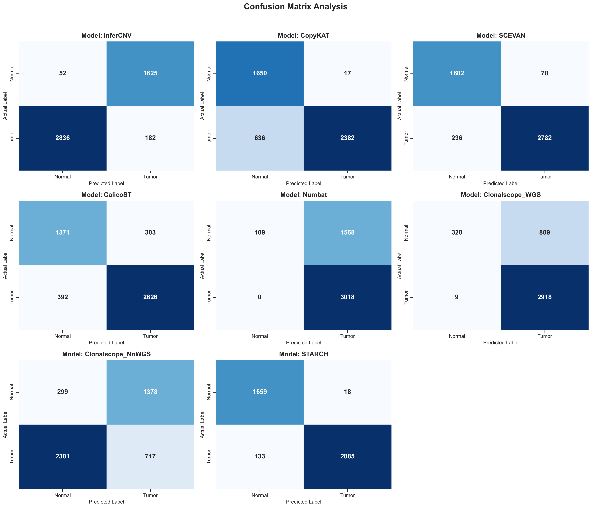

# Tumor-Normal Classification Task Example

This tutorial shows how to run the `tumor_normal` evaluation task.
It uses `HCC-2T` as the example dataset.

## Data Source And Assumptions

The HCC example is based on data from GSA-Human accession `HRA000437`.
Raw FASTQ files are processed through our standard upstream workflow first, and the resulting benchmark-ready package is then used as the input to ST-CNVBench.

In this tutorial, we assume:

- your `data.yaml` contains one dataset entry with `dataset_id: HCC-2T`
- the standardized input package is already available for that dataset
- `tumor_normal_mode` is set to `de_novo`
- `raw.tumor_normal_gt` is set to the real annotation ground truth used for evaluation
- your `models.yaml` already configures the benchmark methods that support `de_novo` tumor-normal inference
- your `eval.yaml` follows the same parameter structure as `configs/templates/eval.template.yaml`

For detailed config requirements, see [Dataset Preparation](../data_preparation.md), [Model Run](../model_run.md), and [Evaluation](../evaluation.md).

## Step 1: Prepare Data

Run:

```bash
st-cnvbench --steps prep \
  --data-config data.yaml \
  --prep-ids HCC-2T
```

Check the prepared dataset under:

```text
<output.root>/
```

Expected standardized outputs include:

- `filtered_feature_bc_matrix/`
- `filtered_feature_bc_matrix.h5ad`
- `spatial/tissue_positions.csv`
- `metadata_HCC-2T_tumor_normal.tsv` or the corresponding standardized tumor-normal annotation file

## Step 2: Run Models

Run all benchmark methods that support `de_novo` tumor-normal inference:

```bash
st-cnvbench --steps run \
  --data-config data.yaml \
  --model-config models.yaml \
  --prep-ids HCC-2T \
  --exec-mode conda
```

Check raw model outputs under:

```text
<results_dir>/HCC-2T/<model_name>/
```

## Step 3: Evaluate Tumor-Normal Classification

Run `tumor_normal` evaluation across all configured methods that support this task:

```bash
st-cnvbench --steps eval \
  --data-config data.yaml \
  --eval-config eval.yaml \
  --prep-ids HCC-2T \
  --eval-tasks tumor_normal
```

Check evaluation outputs under:

```text
<eval_dir>/HCC-2T/tumor_normal/
```

Typical outputs include:

- `aligned_spot_predictions.tsv`
- `detection_metrics_summary.csv`
- `tumor_normal_prediction_comparison.png`
- `tumor_normal_metrics_summary.pdf`
- `tumor_normal_confusion_matrices.pdf`

## Example Results

### Spatial Prediction Comparison

This figure shows the tumor-normal spatial prediction maps across methods.


### Metrics Summary

This figure summarizes the main tumor-normal classification metrics across methods.



### Confusion Matrices

This figure shows the confusion-matrix comparison across methods.



## Try Next

- For the packaged cSCC demo, go to [Quickstart Demo And Expected Outputs](quickstart_demo.md)
- For the CNV profile task example, go to [CNV Profile Task Example](cnv_profile_hcc2t.md)
- For the subclone task example, go to [Subclone Identification Task Example](subclone_identification_slidednaseq.md)
- To adapt the workflow to your own data, go to [Use Your Own Dataset](use_your_own_dataset.md)
